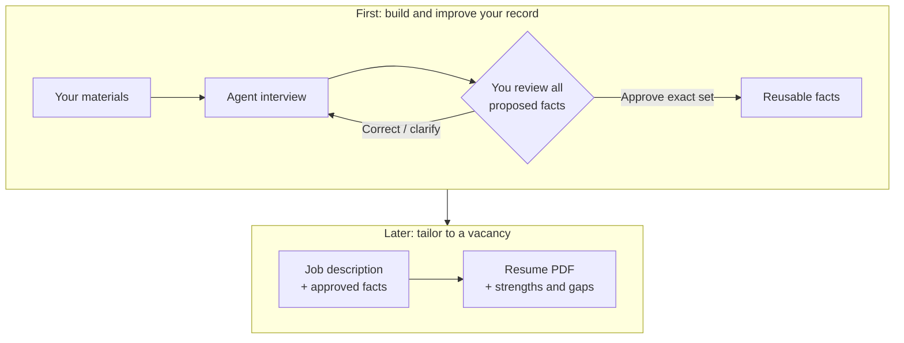

# Career Source

**Career materials → reviewed facts → tailored resumes.**

An evidence-grounded career record, maintained through a coding agent such as Codex or Claude Code. You provide context and approve changes; the agent interviews, maintains the records, and runs validation/rendering. It needs repository and terminal access. No job description is required to build the record.

## Start in the agent chat

Open a private checkout in your agent and provide resumes, project notes, or an account of your experience. Materials can arrive incrementally; setup runs with your permission.

> Read AGENTS.md. Organize these materials into career facts, clarify ambiguous claims, and show the complete proposal with sources and unresolved questions. Wait for my approval before updating canonical records.

## Workflow

- **Intake:** clarify responsibilities, individual contribution, tools, dates and outcomes. Unmeasured results remain unmeasured; files and quality scores alone do not establish approved facts.
- **Review:** receive the complete additions/edits, supporting details and open questions. Approval applies to the exact displayed set; partial approval or later corrections require renewed review.
- **Apply:** provide a vacancy. The agent distinguishes direct support, transferable experience and gaps, then delivers a reviewed PDF and gap report. Submission remains yours.

## Example requests

- “Review my reporting-project notes. Separate my contribution from team outcomes and clarify which results were measured.”
- “Tailor a resume to this vacancy using my approved record. Identify unsupported requirements before drafting.”

**Privacy:** share only material you may disclose; check provider data handling and remove confidential information. Local storage and Git ignores are not confidentiality controls.

[Setup and CLI reference](docs/USER_GUIDE.md) · [Agent contract](AGENTS.md) · [Changelog](CHANGELOG.md) · [MIT](LICENSE)
