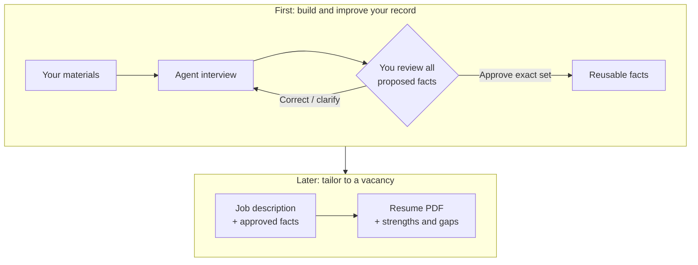

# Career Source

**Turn your career materials into a reusable record of facts — then use those facts to build resumes.** You do not need a job description to start.

You work in a chat with a coding agent. You share materials, answer its questions, and review what it proposes. The agent uses this repository to organize facts, run checks, and produce a resume PDF later. **You do not need to write commands or edit data files.**

This repository supplies the records, checks, and resume renderer; it does not include its own chatbot. You need an external agent that can read and edit the project files and run commands, such as Codex or Claude Code. An ordinary chat without that access cannot save records here.

## How it works



**Three ways to use the same record:** collect your history, clarify or correct existing facts, and later tailor a resume. A job description guides selection and wording — it never supplies facts about you.

## Start in the agent chat

1. **Get a private working copy.** Download this repository to your computer and open its folder in your coding agent. On GitHub, you can use **Code → Download ZIP**, then unzip it. Keep your personal working copy separate from the public project.
2. **Send the message below.** The agent checks the project and handles setup with your permission. If something needs your action, it should explain that single step. It must not overwrite existing records or use fictional demo facts for you.
3. **Share your materials and talk.** Attach files your agent can read, or paste notes. Send them in batches if you like; you do not need to organize everything first. Start with an old resume, project notes, or a description of one role. If a file cannot be read, the agent should tell you and ask for an accessible version or excerpt.

Copy this into the agent chat:

```text
Read AGENTS.md in this project. Help me build my career facts first;
I am not tailoring to a vacancy yet. Check my private working copy
and help me set it up without overwriting existing records.

I will share career materials. Use them to propose facts, not as
already-approved truth. Interview me one role or project at a time,
clarify my contribution and results, and leave unknown details unknown.

Before saving approved records, show me all proposed profile details
and facts, all changes to existing records, and anything still unclear.
Wait for my explicit approval of the exact set. Do not publish anything
or submit an application.
```

**Before sharing files:** remove passwords, unnecessary personal details, and confidential employer or third-party information. Share only material you are permitted to disclose. A local folder does not mean your chat is local: check your agent provider's privacy and retention settings. Do not publish your personal records or source files; ignored files are not a privacy guarantee.

## What the interview improves

The agent turns broad statements into specific, supportable facts: what the situation was, what **you** did, which tools you used, and what changed. It asks where numbers came from and resolves conflicting versions. It can also revisit facts you already approved, but changes need a fresh review.

You do not have to invent a metric to make a fact useful. If a result is unknown or unmeasured, say so. Automated checks flag missing detail and inconsistencies; they cannot prove your history is true.

### Example 1 — build facts without a vacancy

*Illustrative conversation, not real candidate evidence.*

> **You:** Here is my old resume and some project notes. I helped make monthly reporting faster. Help me turn this into facts.
>
> **Agent:** Which part did you personally change? What tools did you use? How was the improvement measured?
>
> **You:** I replaced manual spreadsheet consolidation with a Python script. We did not measure the time saved.
>
> **Agent:** Proposed fact: “Replaced manual spreadsheet consolidation for monthly reporting with a Python script.” Time saved remains unknown; I will not add a percentage. I will show this with the rest of the proposal for your review.

## Review before facts become approved

The agent should **show you the results without waiting to be asked**: the full proposed set, what is new or changed, supporting details, and open questions. Ask for plain language if the review is hard to read; the exact records should also be available to inspect.

Check employers, titles, dates, your contribution, tools, and every number. Then explicitly approve the set you saw. For example: **“I approve all facts and profile details in the proposal you just showed.”** Uploading files, answering questions, or saying “continue” is not approval.

If only part is correct, identify the changes. The agent must show the revised set and ask for confirmation again — not save the rest silently. Unapproved drafts may be kept separately; they are not evidence for a resume. After approval, the agent reports what was saved and what remains unresolved.

If you want to pause and inspect:

> Show all proposed facts, changes, and unresolved questions. Do not save them as approved records yet.

## Later: tailor a resume

Once your facts are approved, send a job description or vacancy link in the same project. The agent selects relevant evidence, identifies missing experience, writes grounded wording, and checks the PDF. You review the claims and final layout before sharing it yourself. The project does not find jobs or submit applications.

### Example 2 — use the facts for a vacancy

```text
Here is a vacancy I want to apply for. Read AGENTS.md and follow the
career-apply workflow. Use my approved facts to show what is directly
supported, what is transferable, and what is missing. Ask about important
undocumented experience before drafting. New facts still need my approval.
Then prepare a tailored resume PDF and a strengths/gaps report.
Do not invent experience or submit anything.
```

## Details when you need them

- [User guide](docs/USER_GUIDE.md) — continuing the interview, privacy, setup, and a fictional walkthrough.
- [Technical setup](docs/USER_GUIDE.md#install) — for your agent or a hands-on author, not a prerequisite for chatting.
- [Agent instructions](AGENTS.md) — the evidence and approval rules your agent must follow.
- [Changelog](CHANGELOG.md) · [MIT license](LICENSE).
